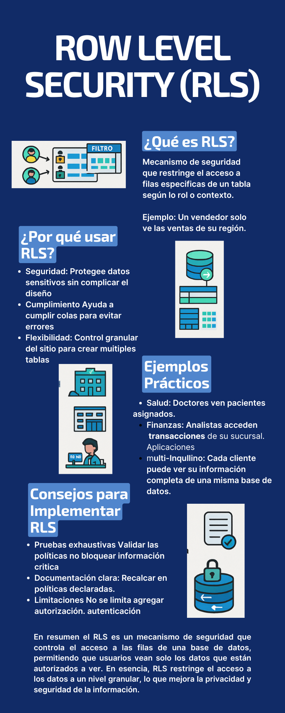

# 📚 Projects Database 2


> Ejemplo visual de implementación de seguridad a nivel de fila (Row-Level Security) en PostgreSQL, incluido en los scripts de este repositorio para reforzar el control de acceso a los datos.

**Ejemplo básico de Row-Level Security (RLS):**
```sql
-- Habilitar RLS en una tabla
ALTER TABLE empleados ENABLE ROW LEVEL SECURITY;

-- Crear una política para que cada usuario solo vea sus propios registros
CREATE POLICY solo_sus_datos
  ON empleados
  USING (usuario = current_user);

-- Activar la política
ALTER TABLE empleados FORCE ROW LEVEL SECURITY;
```

¡Bienvenido/a! Este repositorio contiene una colección de scripts SQL orientados a la práctica y aprendizaje de conceptos avanzados de bases de datos relacionales, especialmente en PostgreSQL. Aquí encontrarás ejemplos de modelado, procedimientos almacenados, triggers, vistas, manejo de usuarios, permisos y más, aplicados a distintos contextos como gestión de contactos, hospitales y tareas.

---

## 🏥 Modelo hospitalario avanzado (`improve_hospital.sql`)

El archivo `improve_hospital.sql` lleva el modelo hospitalario a un nivel profesional, integrando:

- **Tablas adicionales:**  
  - `department`, `room`, `hospitalization`, `insurance`, `patient_emergency_contact`, `medication`, `prescription`, `clinical_history`, `clinical_history_entry`.
  - Permiten gestionar departamentos, habitaciones, hospitalizaciones, seguros, contactos de emergencia, medicamentos y prescripciones.
- **Historial clínico:**  
  - Registro completo de diagnósticos, tratamientos, observaciones y prescripciones para cada paciente.
- **Auditoría:**  
  - Tabla y triggers para registrar cambios críticos en las tablas principales.
- **Triggers inteligentes:**  
  - Al hospitalizar un paciente, se agrega automáticamente una entrada al historial clínico.
  - Notificación automática si se prescribe un medicamento de alto riesgo.
- **Procedimientos almacenados:**  
  - Agregar entradas al historial clínico.
  - Admitir y dar de alta pacientes hospitalizados.
  - Prescribir medicamentos.
  - Función para obtener el resumen del historial clínico de un paciente.
- **Consultas avanzadas:**  
  - Historial clínico completo de un paciente.
  - Pacientes hospitalizados y su habitación.
  - Prescripciones activas.
  - Estadísticas de citas por departamento.
  - Auditoría de cambios.

### 📝 Ejemplo de uso de procedimientos almacenados

```sql
-- Agregar una entrada al historial clínico
CALL add_clinical_history_entry(1, 2, 'Gripe', 'Reposo y líquidos', 'Paciente con fiebre leve');

-- Admitir a un paciente en una habitación
CALL admit_patient(1, 101, 'Observación por fiebre alta');

-- Dar de alta a un paciente hospitalizado
CALL discharge_patient(5);

-- Prescribir un medicamento
CALL prescribe_medication(10, 3, '500mg', 'Cada 8 horas', '2024-06-01', '2024-06-07');

-- Obtener resumen del historial clínico
SELECT * FROM resumen_historial_clinico(1);
```

### 📊 Ejemplo de consulta avanzada

```sql
-- Consultar pacientes hospitalizados actualmente y su habitación
SELECT
    p.name AS paciente,
    r.room_number,
    r.type AS tipo_habitacion,
    h.admission_date
FROM hospitalization h
JOIN patient p ON h.pat_id = p.pat_id
JOIN room r ON h.room_id = r.room_id
WHERE h.discharge_date IS NULL;
```

### ⚡ Ejemplo de triggers inteligentes

- **Ingreso hospitalario:**  
  Al registrar una hospitalización, se crea automáticamente una entrada en el historial clínico del paciente.
- **Notificación de medicamento peligroso:**  
  Si se prescribe un medicamento de alto riesgo (ejemplo: Warfarina), se genera una notificación automática en la base de datos.

---

## ❓ Preguntas Frecuentes (FAQ)

**¿Puedo usar estos scripts en MySQL o SQL Server?**  
La mayoría de los scripts están diseñados para PostgreSQL y pueden requerir ajustes para otros motores.

**¿Cómo ejecuto un procedimiento almacenado?**  
Usa la instrucción `CALL nombre_procedimiento(parámetros);`.

**¿Qué hago si recibo un error de permisos?**  
Verifica que el usuario tenga los privilegios necesarios sobre el esquema y las tablas.

**¿Puedo modificar los scripts para mis propios proyectos?**  
¡Por supuesto! Están pensados para que los adaptes y experimentes.

---


## 🔗 Enlaces Útiles

- [Documentación oficial de PostgreSQL](https://www.postgresql.org/docs/)
- [Tutorial de SQL en W3Schools](https://www.w3schools.com/sql/)
- [Manual de PL/pgSQL](https://www.postgresql.org/docs/current/plpgsql.html)
- [Diagrama de relaciones en DBDesigner](https://www.dbdesigner.net/)
- [PostgreSQL Exercises](https://pgexercises.com/)

---


## 📚 Glosario Rápido

- **Tabla**: Estructura que almacena datos en filas y columnas.
- **Vista**: Consulta guardada que se comporta como una tabla virtual.
- **Vista materializada**: Vista cuyos resultados se almacenan físicamente.
- **Procedimiento almacenado**: Conjunto de instrucciones SQL que se pueden ejecutar como una unidad.
- **Trigger (Disparador)**: Código que se ejecuta automáticamente ante ciertos eventos (INSERT, UPDATE, DELETE).
- **Clave primaria**: Identificador único de cada fila en una tabla.
- **Clave foránea**: Campo que referencia la clave primaria de otra tabla.
- **Transacción**: Conjunto de operaciones que se ejecutan de forma atómica.

---


## 🌟 Mejores Prácticas

- **Usa claves primarias y foráneas** para garantizar la integridad referencial.
- **Define restricciones de unicidad** en campos como emails o nombres de usuario.
- **Utiliza procedimientos almacenados** para lógica compleja y reutilizable.
- **Aplica roles y permisos**: nunca uses el usuario `postgres` para aplicaciones diarias.
- **Aprovecha las vistas y vistas materializadas** para consultas frecuentes o pesadas.
- **Incluye triggers para auditoría** si necesitas rastrear cambios.
- **Haz respaldos periódicos** de tus bases de datos.

---


## 📝 Ejemplos de Consultas y Uso

### 1. Consultar las tareas pendientes de un usuario

```sql
SELECT t.titulo, t.estado
FROM tareas t
JOIN usuarios u ON t.usuario_id = u.id
WHERE u.nombre = 'Juan Pérez' AND t.estado = 'pendiente';
```

### 2. Crear una nueva tarea con prioridad alta

```sql
INSERT INTO tareas (titulo, descripcion, estado, usuario_id, prioridad_id, fecha_limite)
VALUES ('Preparar presentación', 'Presentación para la junta directiva', 'pendiente', 1, 3, '2025-06-01');
```

### 3. Ver las dos tareas con prioridad alta

```sql
SELECT titulo, estado
FROM tareas
WHERE prioridad_id = (SELECT id FROM prioridades WHERE nombre = 'alta')
LIMIT 2;
```

---


## 🧩 Diagrama Conceptual (Texto)

A continuación, un esquema simplificado de cómo se relacionan algunas de las entidades principales en los scripts:

```
[usuarios]───< (1:N) >───[tareas]───< (N:M) >───[etiquetas]
     │                        │
     │                        └───< (1:N) >───[comentarios]
     │
     └───< (1:N) >───[prioridades]
```

- Un usuario puede tener muchas tareas.
- Una tarea puede tener muchas etiquetas (y viceversa).
- Una tarea puede tener muchos comentarios.
- Las tareas tienen una prioridad asignada.

---


## 🗂️ Estructura del Proyecto

- **class_view_database.sql**  
  Ejemplos de creación de tablas, inserción de datos, vistas y vistas materializadas para un sistema de gestión de tareas (todolist). Incluye relaciones entre usuarios, tareas, prioridades, etiquetas y comentarios.

- **configure_databse.sql**  
  Script para la configuración inicial de la base de datos: creación de esquemas, tablas básicas, usuarios y asignación de permisos.

- **improve_configure_database.sql**  
  Versión mejorada del script anterior, con mejores prácticas de seguridad, triggers para auditoría, y manejo avanzado de permisos y roles.

- **contacts.sql**  
  Modelo de datos para una agenda de contactos con categorías. Incluye restricciones de unicidad y claves foráneas.

- **hospital.sql**  
  Modelo relacional para un sistema hospitalario: especialidades, doctores, pacientes, citas y tratamientos. Incluye relaciones y restricciones de integridad referencial.

- **improve_hospital.sql**  
  Modelo hospitalario avanzado: incluye historial clínico, hospitalización, departamentos, habitaciones, seguros, contactos de emergencia, medicamentos, prescripciones, auditoría, triggers inteligentes y procedimientos almacenados para la gestión integral de un hospital.

- **loops.sql**  
  Ejemplos de procedimientos almacenados y funciones que utilizan ciclos (`LOOP`, `WHILE`, `FOR`, `FOREACH`) y manejo de errores en PL/pgSQL.

- **practice_examen.sql**  
  Ejercicios prácticos avanzados: creación dinámica de vistas, vistas materializadas, transacciones, clonación de tablas, y procedimientos reutilizables para manipulación de datos.

- **process_stored.sql**  
  Funciones y procedimientos almacenados para operaciones matemáticas, concatenación de datos, consultas parametrizadas y lógica condicional.

---

## 🛠️ ¿Qué puedes aprender aquí?

- **Modelado relacional**: Diseño de tablas, claves primarias, foráneas y relaciones muchos a muchos.
- **Procedimientos y funciones**: Cómo crear y utilizar procedimientos almacenados y funciones personalizadas en PostgreSQL.
- **Vistas y vistas materializadas**: Generación de vistas para consultas complejas y optimización de rendimiento.
- **Triggers y auditoría**: Automatización de tareas y registro de cambios en las tablas.
- **Gestión de usuarios y permisos**: Buenas prácticas para la seguridad y control de acceso.
- **Manejo de errores y transacciones**: Ejemplos de control de flujo y robustez en operaciones críticas.

---

## 🚀 Cómo usar este repositorio

1. **Pre-requisitos**:  
   - PostgreSQL instalado (recomendado versión 13+)
   - Un cliente SQL (psql, DBeaver, PgAdmin, etc.)

2. **Carga de scripts**:  
   Ejecuta los archivos `.sql` en el orden que prefieras según el tema que quieras practicar. Por ejemplo:
   ```sh
   psql -U tu_usuario -d tu_base_de_datos -f configure_databse.sql
   psql -U tu_usuario -d tu_base_de_datos -f improve_configure_database.sql
   ```

3. **Explora y modifica**:  
   Puedes adaptar los scripts a tus necesidades, experimentar con los procedimientos y funciones, o combinarlos para crear tus propios ejercicios.

---

## 📄 Ejemplo de uso

Supón que quieres practicar la creación de un sistema de tareas con usuarios y prioridades:
1. Ejecuta `class_view_database.sql` para crear las tablas y vistas.
2. Inserta algunos usuarios y tareas.
3. Prueba los procedimientos almacenados para clonar tareas, crear vistas dinámicas o listar tareas según prioridad.

---

## 🤝 Contribuciones

¿Tienes una mejora, corrección o nuevo ejercicio? ¡Eres bienvenido/a a contribuir! Puedes abrir un Pull Request o sugerir cambios vía Issues.

---

## 📝 Licencia

Este proyecto es de uso libre para fines educativos y personales.

---

¡Feliz aprendizaje y mucha suerte en tu camino como experto/a en bases de datos! 🚀
